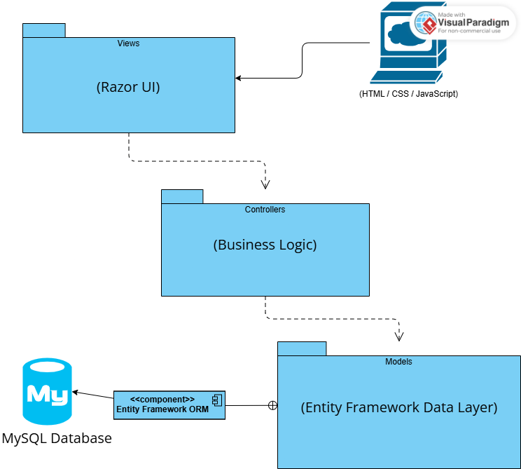
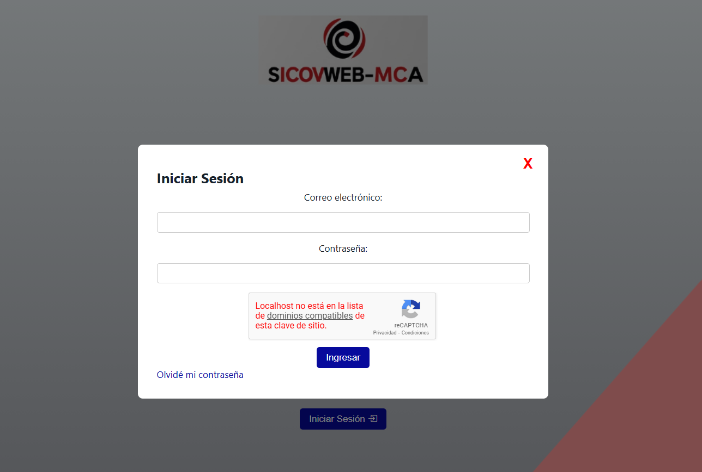
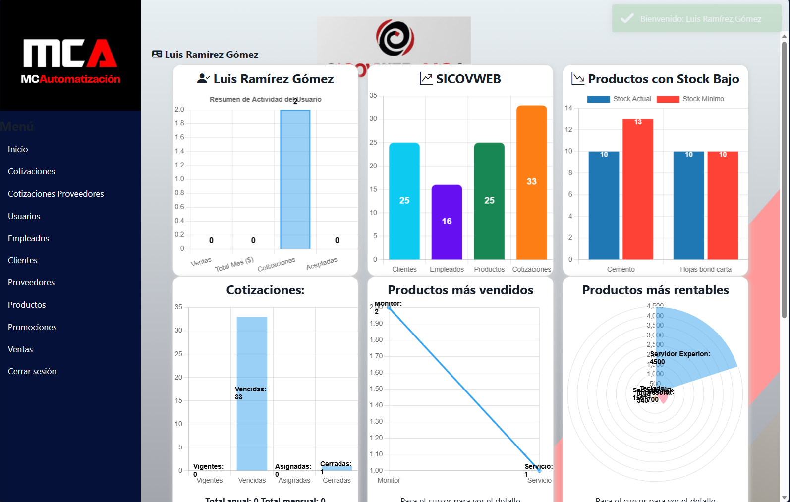
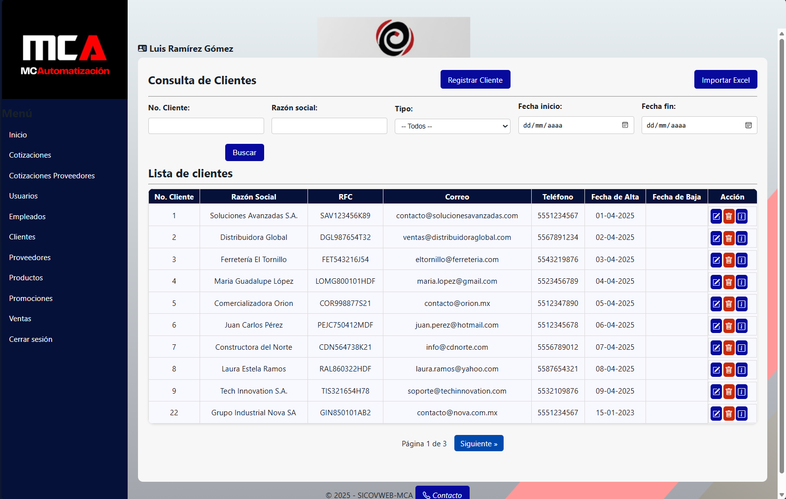
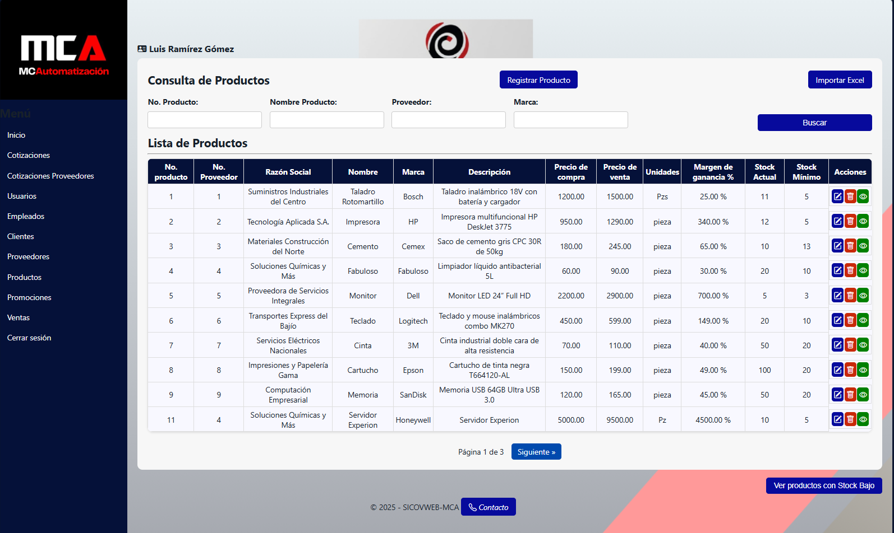
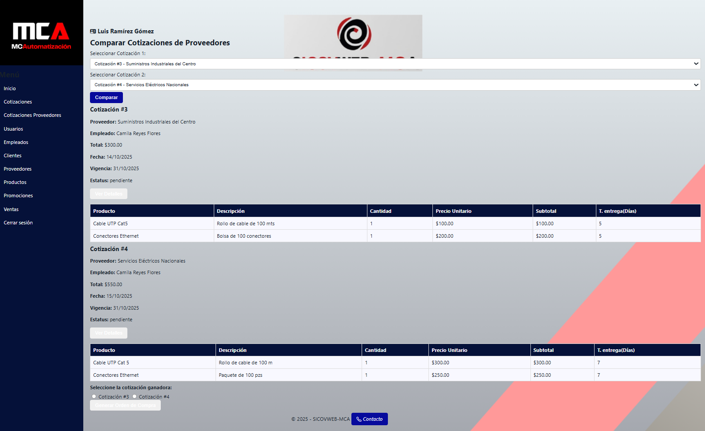
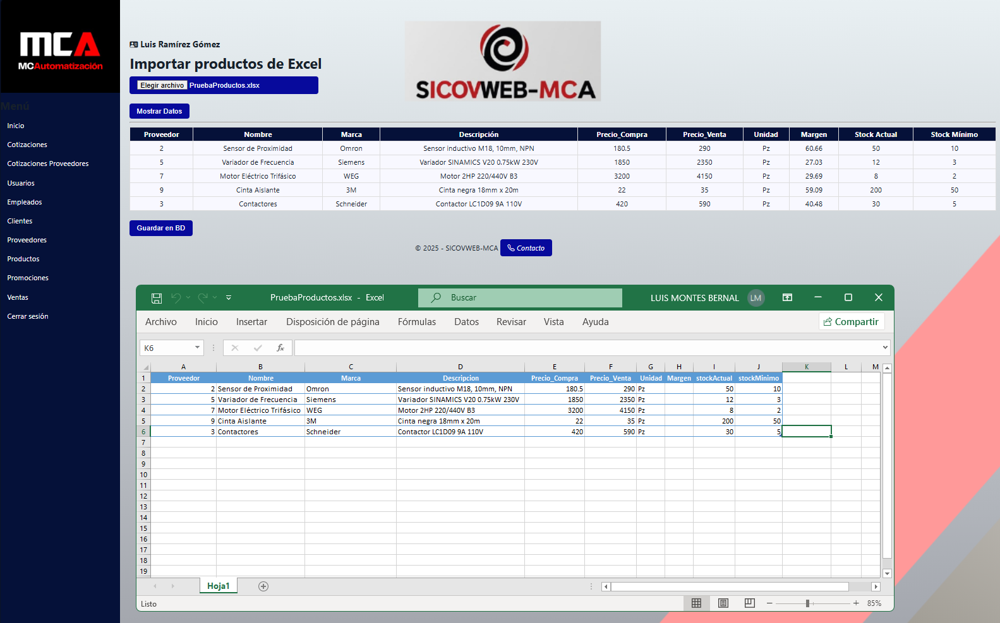
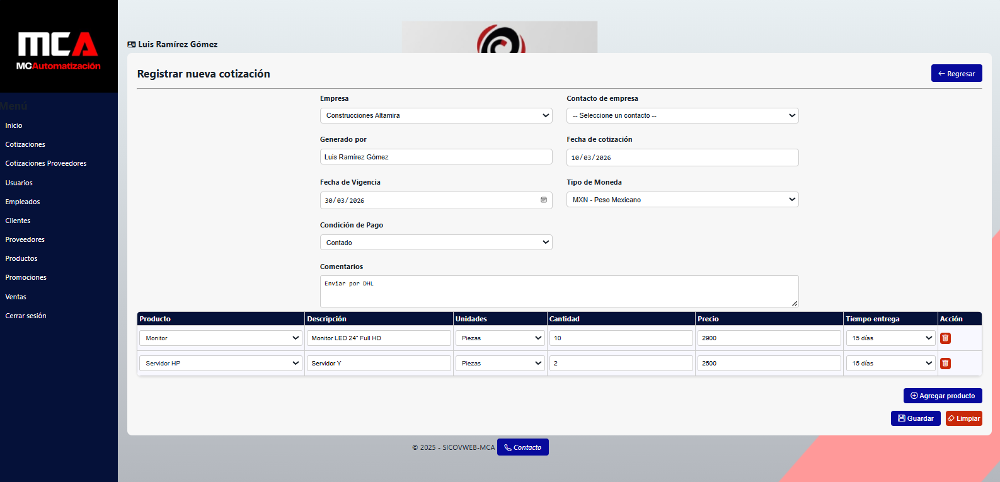
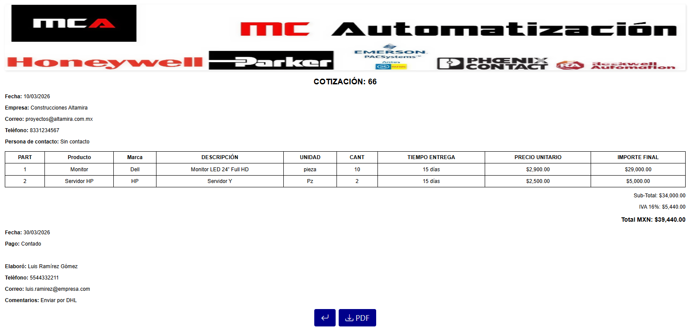
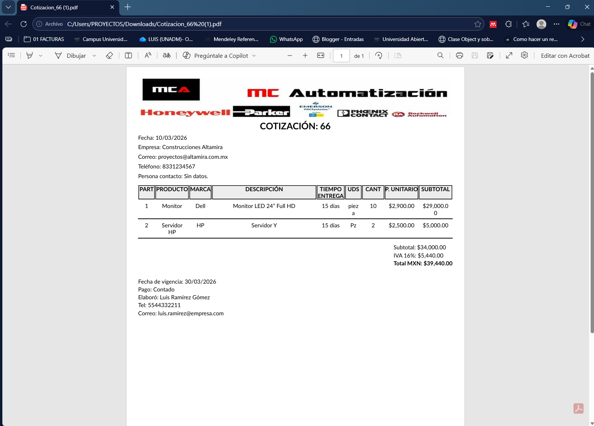

# SICOVWEB-MCA (SISTEMA INTEGRAL DE COTIZACIONES Y VENTAS)

# Sales, Inventory and Quotation Management System

## Overview

SICOVWEB is a web-based business management system designed to manage **customers, suppliers, inventory, quotations, and sales operations** for small and medium-sized businesses.

The system was developed using **ASP.NET MVC, C#, Entity Framework, and MySQL**, following a modular architecture that separates business logic, presentation, and data access layers.

It provides tools to streamline business operations such as quotation comparison, Excel data import, PDF document generation, and inventory management.

---

## Technology Stack

### Backend
- ASP.NET MVC (.NET)
- C#
- Entity Framework

### Frontend
- HTML5
- CSS3
- JavaScript
- Razor Views

### Database
- MySQL

### Libraries
- QuestPDF (PDF document generation)
- Google reCAPTCHA (form protection)

---

## System Architecture

The application follows the **Model–View–Controller (MVC)** architectural pattern.

### Architecture diagram

This architecture provides:

- Separation of concerns
- Maintainable code structure
- Scalability for future development

---

## Core Features

### Customer Management
- Customer registration and editing
- Customer database management
- Search and filtering functionality

### Supplier Management
- Supplier registration
- Supplier data management

### Product & Inventory Management
- Product catalog management
- Inventory tracking
- Product pricing management

### Quotation Comparison Module
Allows comparison between supplier quotations to determine the most cost-effective purchasing option.

### Excel Import System
Bulk data import for:

- Products
- Customers

Excel files are validated before inserting records into the database.

### Sales Management
- Sales registration
- Customer purchase history
- Product sales tracking

### Promotions
- Promotional pricing configuration
- Discount management

### Employee & User Management
- User authentication
- Employee data management
- Role-based access control

---

## Technical Features

- Server-side pagination for efficient data loading
- Secure forms using Google reCAPTCHA
- PDF document generation using QuestPDF
- Excel file processing for bulk data import
- Entity Framework ORM for database interaction
- Modular MVC application structure

---

## Database Design

The relational database was designed in **MySQL** following **Third Normal Form (3NF)** principles.

Main entities include:

- Users
- Employees
- Customers
- Suppliers
- Products
- Quotations
- Sales
- Inventory Movements
- Promotions

This structure ensures:

- Data integrity
- Efficient queries
- Scalable data relationships

---

## Screenshots

### Login Page

### Dashboard

### Customer Management

### Inventory Management

### Quotation Comparison Module

### Excel Import Module

### Quotation form

### Document preview

### PDF Document Generation

---

## Example Use Cases

- Manage customer and supplier information
- Track inventory and product pricing
- Compare supplier quotations
- Import large datasets from Excel files
- Generate professional quotation PDFs
- Manage sales and promotional pricing

---

## Project Purpose

This project was developed to demonstrate practical experience in:

- Full-stack web development
- ASP.NET MVC architecture
- Relational database design
- Business application logic
- Backend development using .NET technologies

---

## Author

**Luis Ángel Montes Bernal**

Software Development Engineer  

Mexico City, Mexico

---

## Future Improvements

- REST API integration
- Advanced reporting dashboard
- Role-based permission management improvements
- Deployment to cloud environment